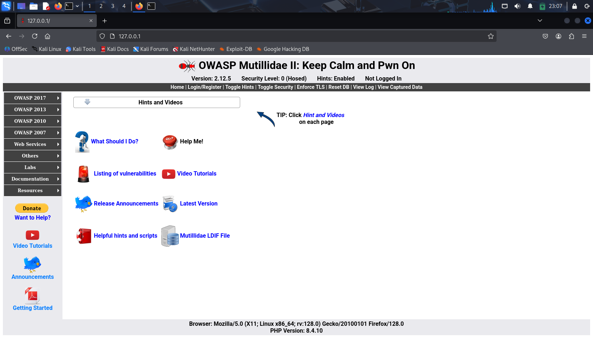
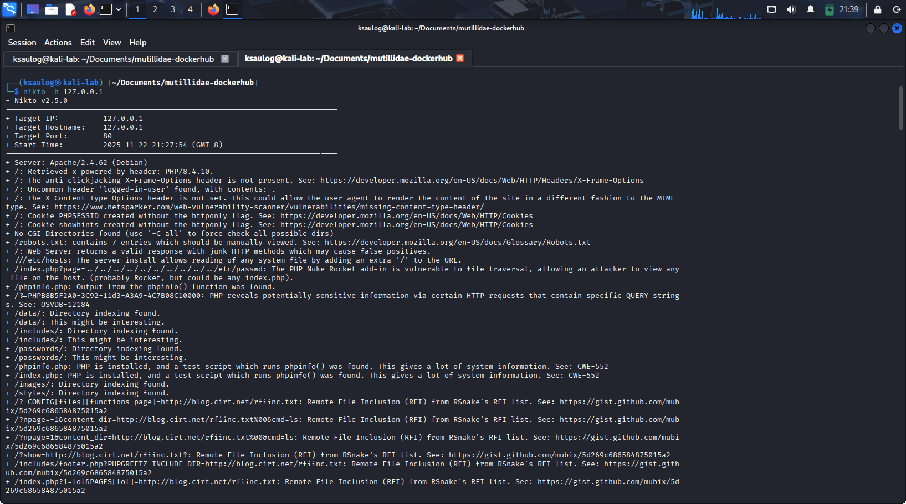
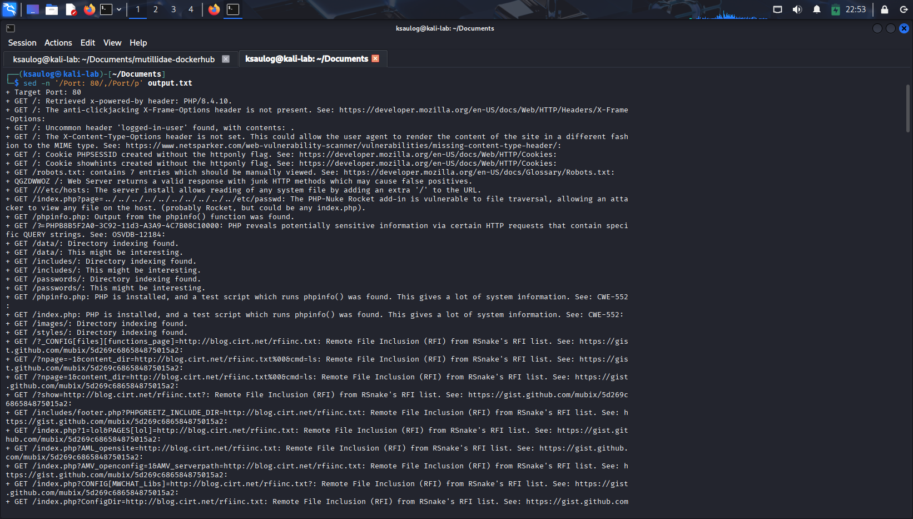
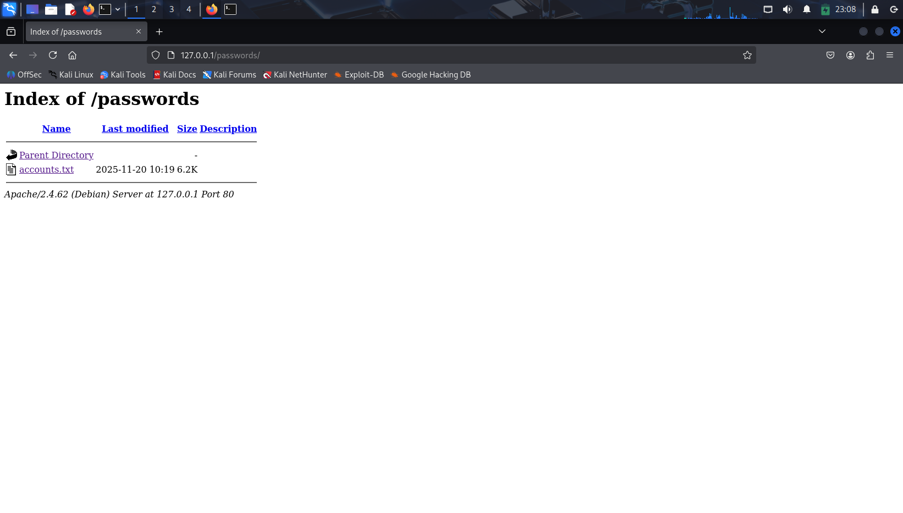

# Nikto Lab for INFO 2311 Project

## Purpose and Intent

The purpose of this lab is to help students learn how to use Nikto and understand what it is capable of. Students will run scans on a test web server and observe how Nikto detects outdated software, misconfigured settings, and exposed files. The lab will focus on hands-on use of the tool so students can see how vulnerabilities are identified in a real environment. 
 
This lab must be done in a safe testing environment, and students should not scan any systems outside of their network. 

## Requirements to run lab

1. Kali Linux VM (Nikto comes pre-installed with Kali)
2. Docker (Optional but recommended)
3. Some vulnerable web server
## Lab Steps
### Step 1: Install Docker

We install Docker to make it easier to acquire and run some publicly available web applications. To install Docker, we will follow their [installation guide](https://docs.docker.com/engine/install/debian/) for installing Docker on Debian, which Kali Linux is based on. 

First uninstall potentially conflicting packages:

```shell
sudo apt remove $(dpkg --get-selections docker.io docker-compose docker-doc podman-docker containerd runc | cut -f1)
```

There are multiple ways to download Docker, but we will be using the `apt` repository. Following the guide, we have to add the Docker repository to Apt sources:

```shell
sudo apt update
sudo apt install ca-certificates curl
sudo install -m 0755 -d /etc/apt/keyrings
sudo curl -fsSL https://download.docker.com/linux/debian/gpg -o /etc/apt/keyrings/docker.asc
sudo chmod a+r /etc/apt/keyrings/docker.asc

sudo tee /etc/apt/sources.list.d/docker.sources <<EOF
Types: deb
URIs: https://download.docker.com/linux/debian
Suites: bookworm    # Kali Linux's stable debian release
Components: stable
Signed-By: /etc/apt/keyrings/docker.asc
EOF

sudo apt update
```

Now that that `apt` basically knows where to get Docker from, install the latest versions of the Docker packages.

```shell
sudo apt install docker-ce docker-ce-cli containerd.io docker-buildx-plugin docker-compose-plugin
```

To verify the installation and that docker is running, run:

```shell
sudo systemctl status docker
```

If it's not running, start Docker using:

```shell
sudo systemctl start docker
```

### Step 2. Download a vulnerable web application

To demonstrate Nikto, we need a target web application. Nikto is an active scanner so it's not advisable to use it on websites you don't have permissions to test on. Luckily, there are many vulnerable websites that are designed for teaching web security. The web app that we will be using for this lab is called [OWASP Mutillidae II](https://owasp.org/www-project-mutillidae-ii/) which it is built on a LAMP stack. 

There are multiple ways of building the Mutillidae website, but for ease we will be using a pre-built image available on DockerHub.

First grab the code from [mutillidae-dockerhub](https://github.com/webpwnized/mutillidae-dockerhub):

```shell
git clone https://github.com/webpwnized/mutillidae-dockerhub.git
cd mutillidae-dockerhub.git
```
> `git` is readily available with Kali Linux, install if you don't have it

Notice that there is a **docker-compose.yml** file in the directory we just downloaded. The file gives instructions to `docker compose` to pull the images from DockerHub, run them, and connect them through the instructed ports and networks.

To initialize the containers:
```shell
docker compose up
```

Now the website is running on [127.0.0.1](127.0.0.1). Very simple compared to building it yourself!

When you first access the website, the site will tell you that the database hasn't been initialized and will direct you to click on a link to initialize it. Once the database has been set up, now is a good time to scan the website using Nikto.



### Step 3: Running Nikto commands

To get started with Nikto, let's see what options it has. Run:

```shell
nikto
```

>**Question**: Do you see any options that could be useful?

At the top of the output, you will see it says:

```shell
+ ERROR: No host (-host) specified
```

This means that at the minimum you need to supply Nikto with a target host IP or URL after the `-h` option. You will also see the other options available to tweak how the tool behaves. 

To run Nikto on our server, specify the IP address:

```shell
nikto -h 127.0.0.1
```

The output of scan of the Nikto scan shows the potentially vulnerable configurations of the website. It does this by sending commonly used HTTP requests to the endpoint. 

>**Question**: Name some interesting information from nikto's output. Some are more eye-catching than the others!



The default behavior of Nikto is to scan port 80 (http) of the host, but we know from [Mutillidae's documentation](https://github.com/webpwnized/mutillidae-dockerhub) that there are other services running in different ports (typing `docker ps` shows the containers and their ports too). To scan other or even multiple ports, we can pass in  `-p <PORT|PORTS> ` to our command.

We can expect this scan to take longer as we're checking more than one port this time. Saving the data an output can save us time in case we need the information again in the future. Nikto takes a `-o <outfile>`  to save the output to a file. 

Adding the port and output options to our command we now have:

```shell
nikto -h 127.0.0.1 -p 80-443 -o output.txt
```
> The `-p` option can take in one, multiple specified, or even a range ports.

Now that we have our output we can now sift through the information. However, it'll be much harder trying to sift through the entire file at once. If you run `cat output.txt | wc -l`, you can see there are 335 lines in the file. We can simplify our task by printing our output per port. One way to accomplish this is by using `sed`.

```shell
# Change '80' to whatever port you want to check
sed -n '/Port 80/,/Port/p' output.txt
```

The `sed` command above basically says "Print all the lines starting from when you see Port 80, until you see the next Port". Let's check some of the routes from the Port 80 output. 



If you spotted the /passwords route, that is a great route to check for security purposes. To access these routes, we need to send an http request to the route, along with its listed method. Any browser can do this or alternatively you can use the `curl` tool on the command line.



Investigate the **accounts.txt** file further and you will see a list of accounts, even the admin account!


Go back to the home page and go to the login section, and try to log in with the admin credentials. If you succeeded, you just found a vulnerability with Nikto!

>**Question**: How would you describe the vulnerability we just found and what can a web developer do to fix it?

If you're interested in checking other routes that are security risks, try looking at `:80/phpinfo.php` and `:80/robots.txt`. However, it is worth noting that not all the information leads to a vulnerability. You tune the scan to some degree using plugins or the `-Tuning` option, but Nikto is generally used as a preliminary scan to find the glaring vulnerabilities of a web server. Nikto is commonly used in conjunction with other tools to identify and test the security of a web server.

>**Question**: What are the limitations of using Nikto?

>**Question**: What tools can we use to improve our security assessment of a web server?

## Questions (restated)

1. Name the 3 options we used for the `nikto` command and what they do
2. Give 3 potentially interesting output lines from `nikto`
3. How would you describe the vulnerability we found by checking the /passwords route and what can a web developer do to fix?
4. What are the limitations of using `nikto`
5. What tools can we use to improve our security assessment of a web server

## References

Mutillidae: https://owasp.org/www-project-mutillidae-ii/

Docker: https://docs.docker.com/engine/install/debian/

Nikto: https://github.com/sullo/nikto
